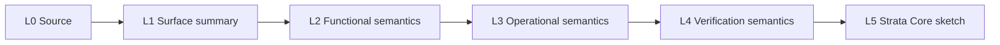

# Stackable Semantics Plan

This project attaches semantics to the Java corpus as a chain of increasingly
formal layers. The goal is not just to translate Java syntax. The useful demo is
that Lean can host several semantics for the same source program and let us
state relationships between them.

## Call-Derived Intent

The 2026-05-20 11:13-12:19 Pacific Limitless lifelog for the SPS hackathon
discussion pointed to this project shape:

- Syntax translation is only the base layer.
- The more valuable step is semantics: facts about what programs mean, such as
  "this result is always even" or "this function returns the sum of these
  values."
- Java is a lower-risk source language than Python for a short hackathon
  because the language is familiar, existing verification tooling has Java
  history, and Strata already has Boogie-like verification support.
- Comments or small assignment specs can serve as immediate informal semantics.
  The deliverable is to lift those into formal statements in Lean, Boogie, or
  Strata-compatible Core.
- Early success does not need a fully mechanized end-to-end frontend. It is
  acceptable to generate candidate formal code, compile what can be compiled,
  and visually inspect the artifacts.

## The Semantic Chain

Each Java program now gets five attached semantic layers.

| Layer | Name | Purpose |
| --- | --- | --- |
| L0 | Source | Points to the exact Java class and methods. |
| L1 | Surface summary | Human-readable intent, usually close to an assignment comment. |
| L2 | Functional semantics | Input/output relation independent of Java execution details. |
| L3 | Operational semantics | State, loop, call, and mutation story needed to justify L2. |
| L4 | Verification semantics | Preconditions, postconditions, invariants, and proof obligations. |
| L5 | Strata Core sketch | Boogie-like procedure/spec shape that can be massaged toward Strata. |

These layers are chained, not merely listed:

Each arrow has a job:

| Link | Consumes | Emits | Obligation |
| --- | --- | --- | --- |
| L0 -> L1 | Java source and method signatures | English intent | The summary names what the code is trying to compute. |
| L1 -> L2 | English intent | Input/output relation | Ambiguous prose becomes a mathematical relation. |
| L2 -> L3 | Functional relation | Execution story | The relation is justified by calls, branches, loops, and mutation. |
| L3 -> L4 | Execution story | Proof obligations | Invariants and pre/postconditions cover the operational steps. |
| L4 -> L5 | Proof obligations | Strata Core procedure/spec names | The obligations have a Boogie-like target shape. |

The chain is deliberately redundant. That is the point: a theorem prover can
relate adjacent layers instead of forcing every tool to choose one semantics.
More importantly, once a link is established, the resulting fact can be used by
later links. That reuse is what ordinary Java/Python-style languages cannot do
natively: a comment can say a result is always even, but the language cannot
turn that claim into a theorem that another method proof consumes.

This is the distinctive claim for the project.

The current Core sketch starts this reuse concretely for the original 10
programs: each has stronger pre/postconditions inferred from code comments,
method bodies, and direct reading, plus a derived procedure that stacks one
extra property on top of those contracts. The 40 expansion programs currently
remain lightweight procedure/spec anchors until they receive the same review.

The sketch now also has a first executable reuse path. `max3` and `collatzNext`
are defined as Core functions, the corresponding procedures compute with
assignment or branching instead of assuming their result, and
`ArithmeticFacts_scoreViaCalls` chains three verified procedure contracts
(`sum`, `product`, `maxOfThree`) to prove a later score relation and an
all-inputs-equal corollary.

## How To Read The Artifacts

- [semantics/cs61b-java/stack-semantics.json](/Users/alokbeniwal/StrataJava/semantics/cs61b-java/stack-semantics.json) is the
  machine-readable index of semantic cards for all 50 programs, including the
  required chain links.
- [semantics/strata-core/cs61b-java/CoreSketch.core.st](/Users/alokbeniwal/StrataJava/semantics/strata-core/cs61b-java/CoreSketch.core.st) is a first
  Strata Core/Boogie-like target sketch. It is intentionally a semantic sketch,
  not a promised complete Java frontend, but it is now checked against the
  current Strata `strata verify` command.
- [scripts/check-semantics.py](/Users/alokbeniwal/StrataJava/scripts/check-semantics.py) validates that every corpus source file has a semantic
  card, every semantic card has the required stack layers, and every listed
  Strata procedure name appears in the Core sketch.
- [scripts/check-strata-core.sh](/Users/alokbeniwal/StrataJava/scripts/check-strata-core.sh) builds a Strata checkout, parses the Core sketch,
  type-checks it, generates verification conditions, and runs an SMT pass when
  a solver is available.
- [lean/strata/boogie](/Users/alokbeniwal/StrataJava/lean/strata/boogie) is the stable Lean/Strata/Boogie-facing path for that same Core target.

## Current Scope

The corpus intentionally avoids exceptions, recursion, unbounded loops, aliasing
heavy heap programs, and Java library semantics. The Wednesday notes specifically
motivated Java/Boogie as the derisked path because Python's dynamism would make
the semantic chain harder to stabilize in a weekend.

For now, strings, arrays, and union-find are abstracted at the semantic boundary
where needed:

- String-producing functions get length/shape properties first.
- Array-producing functions get count, membership, and ordering properties
  before full extensional array equality.
- Union-find gets relation-level properties before a full heap/alias model.

These abstractions are not evasions. They are the seam where the stack pays off:
we can put a weak but useful semantic layer underneath a stronger future one.

## Reuse Examples

The chain should support theorem-like reuse:

- `DoubleCharacters.doubleUp` establishes the doubled-length fact; `doubledLength`
  should use that fact rather than reopening the loop proof.
- `EvenFilterArray.countEvens` establishes the output length for `evens`; `evens`
  adds membership and order-preservation facts on top.
- `ArrayMinMax.minValue` and `maxValue` establish extremum facts; `minMaxDifference`
  uses both to state the spread relation.
- `TinyUnionFind.union` establishes a relation-level connectivity update;
  `demoScore` uses the union summaries to justify the fixed result.
- `ArrayCopy.copy` establishes length-preserving element copy semantics;
  `SelectionSortCopy.sortedCopy` stacks sortedness and permutation obligations
  on top of that copy fact.
- `ArrayCountTarget.countTarget` establishes target multiplicity;
  `ArrayReplaceTarget.replace` reuses that count as the number of modified
  positions.
